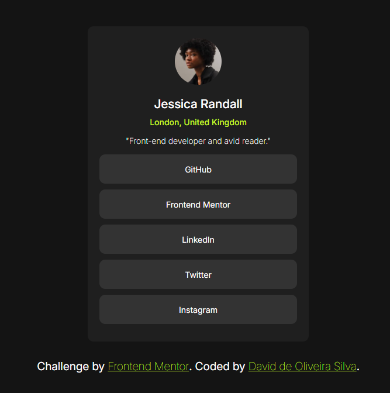
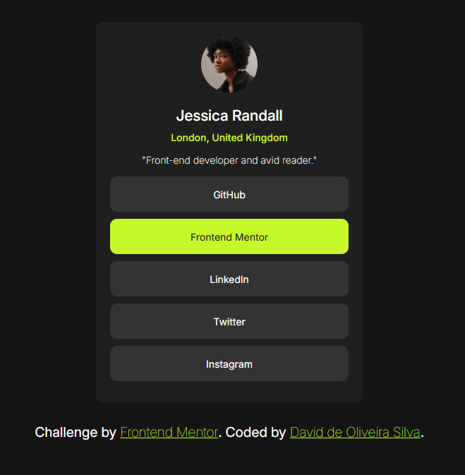

# Frontend Mentor - Social links profile solution

This is a solution to the [Social links profile challenge on Frontend Mentor](https://www.frontendmentor.io/challenges/social-links-profile-UG32l9m6dQ). Frontend Mentor challenges help you improve your coding skills by building realistic projects. 

### 🖼️ Screenshot

🖥️ Desktop preview

---

### 🔗 Links

- Solution URL: 🐙 [GitHub Repository](https://github.com/davidOliveira1995/social-links-profile-main)
- Live Site URL: 🌐 [GitHub Pages](https://davidoliveira1995.github.io/social-links-profile-main/)

## My process

### Built with

- Semantic HTML5 markup
- CSS custom properties
- Flexbox
- Mobile-first workflow

## Author

- 💻 Github - [David de Oliveira Silva](https://github.com/davidOliveira1995)
- 🎯 Frontend Mentor - [@davidOliveira1995](https://www.frontendmentor.io/profile/davidOliveira1995)
- 💼 Linkedin - [David Oliveira](https://www.linkedin.com/in/david-oliveiraos/)
